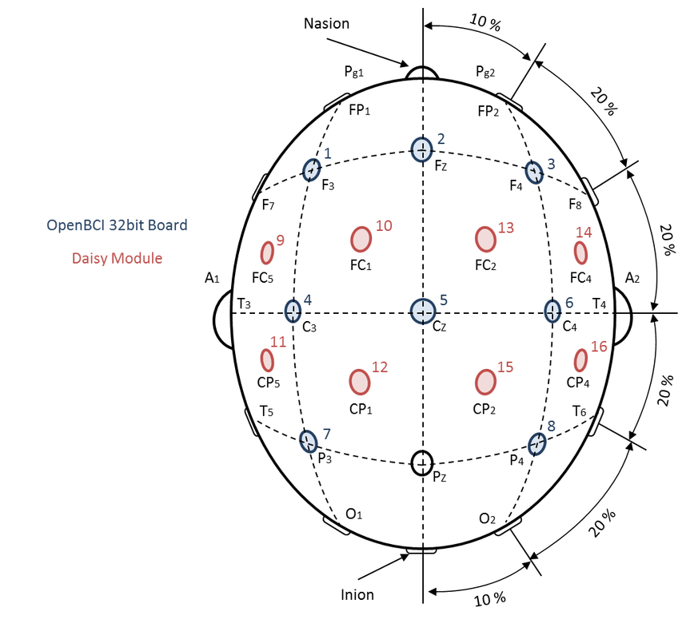

**[Getting Started](#getting-started)** | **[BCI Devices](#bci-devices)** | **[Drones](#drones)**

# Mindcraft

## Getting Started

## BCI Devices

### OpenBCI

Mindcraft leverages a 16 electrode OpenBCI EEG Headset setup with the daisy module.

Product List:

- Ultracortex Mark IV EEG Headset, 16 Channels
  - https://shop.openbci.com/collections/frontpage/products/ultracortex-mark-iv?variant=23280742211
- Cyton + Daisy Biosensing Boards
  - https://shop.openbci.com/collections/frontpage/products/cyton-daisy-biosensing-boards-16-channel?variant=38959256526

### NeuroSky

If looking to leverage the NeuroSky demo you will need a MindWave Mobile 2 EEG Headset. NeuroSky does not sell their headset direct from their online store, you will need to purcahse it from Amazon.

- https://store.neurosky.com/pages/mindwave
- https://www.amazon.com/dp/B07CXN8NKX/ref=cm_sw_r_tw_dp_U_x_YV1CCb5NCHRKY

## Drones
